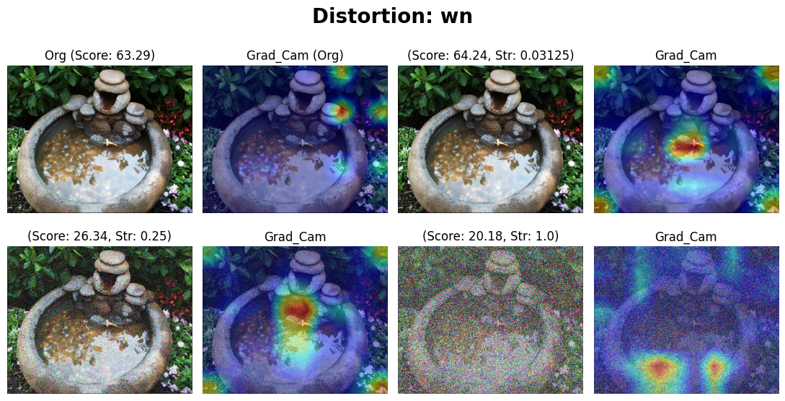
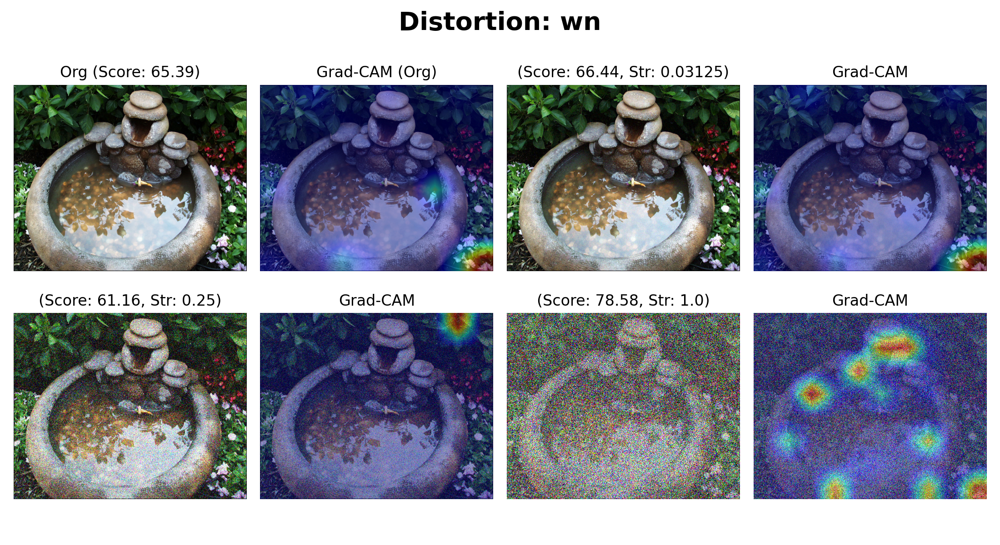
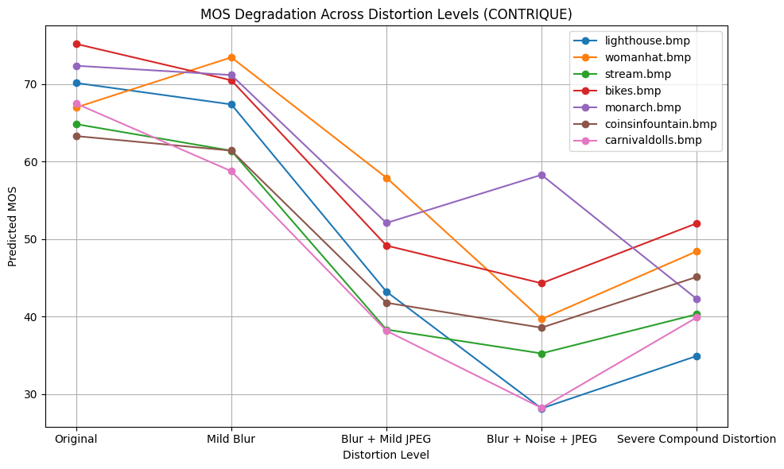
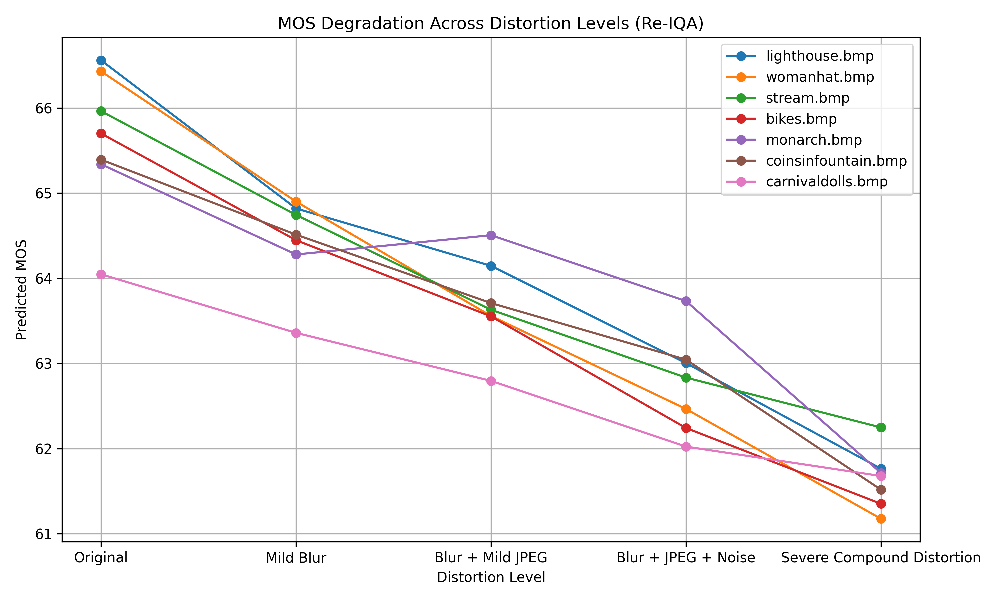
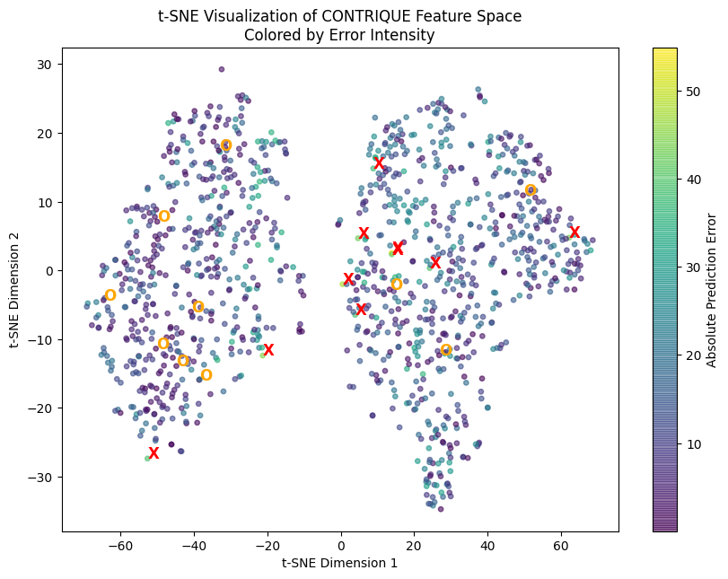
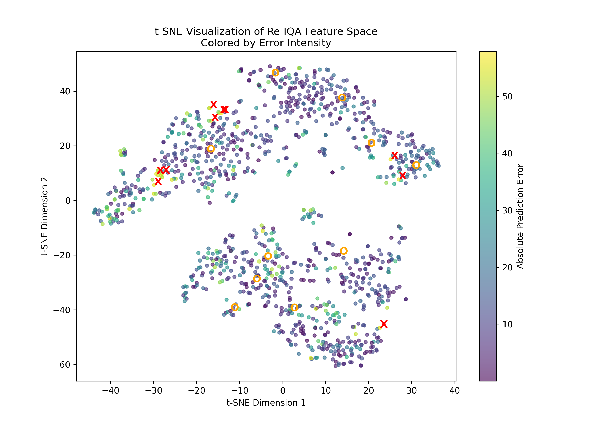
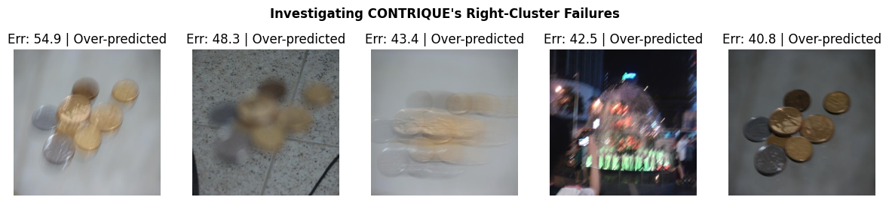
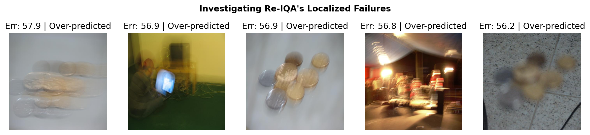
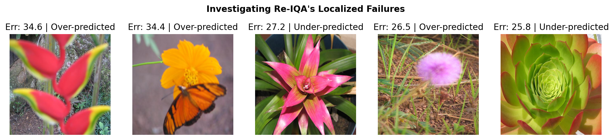

# CONTRIQUE vs Re-IQA: Experimental Analysis

## Introduction & Scope

This project explores a prominent baseline approach and its direct extension:

* **CONTRIQUE (Baseline):** Addresses the challenge by teaching a neural network to recognize different types of synthetic image degradations (like Gaussian blur or JPEG compression). It uses contrastive learning to group similar distortions and explicitly predicts the exact type and severity of the distortion.
* **Re-IQA (Extension):** Argues that real-world ("in-the-wild") images contain a complex mix of artifacts, making explicit classification limiting. It introduces a dual-branch system that strictly separates image content from degradation, organizing its feature space based on a relative ranking approach rather than artificial distortion categories.

**Scope of the Project:**
Rather than just comparing benchmark scores, this project presents a deep-dive comparative study to visually and mathematically understand the mechanics of these feature spaces. The scope of experimentation includes:
1.  **Grad-CAM Analysis:** Checking the semantic emphasis given by the models to understand if they evaluate based on local textures or holistic content.
2.  **Compound Distortion Stress Testing:** Evaluating model robustness and MOS (Mean Opinion Score) degradation when a mixture of blur, compression, and noise breaks the single-class distortion assumption.
3.  **Error-Driven Feature Space Analysis (t-SNE):** Projecting high-dimensional feature arrays to observe structural differences, identifying exactly where and why these models fail on specific geometries and distortions.

## Authors
* **Tejash More** 
* **Arjun Mallick**

## Repository Structure

    📦 Project
     ┣ 📂 contrique/                 # Wrappers and utilities for CONTRIQUE
     ┃ ┣ 📜 wrapper.py               # Custom wrapper for CONTRIQUE inference
     ┃ ┗ 📜 Clone the Contrique repo here.txt
     ┣ 📂 ReIQA-main/                # Custom scripts for Re-IQA
     ┃ ┣ 📜 load_trained_model.py    # Utility to load pretrained Re-IQA weights
     ┃ ┣ 📜 sample.py                # Sample inference script
     ┃ ┗ 📜 Clone the reiqa official repo here.txt
     ┣ 📂 output/                    # Generated t-SNE plots, error maps, and saved results
     ┃ ┣ 📜 contrique_results_livec.csv
     ┃ ┣ 📜 reiqa_results.pkl
     ┃ ┗ 📜 exp*.png                 # Result visualizations (t-SNE, distortion comparisons)
     ┣ 📜 1. experiment_contrique.ipynb # Inference, evaluation & analysis of CONTRIQUE
     ┣ 📜 2. experiment_reiqa.ipynb     # Inference, evaluation & analysis of Re-IQA
     ┣ 📜 3. reiqa_reg_train.ipynb      # Training/fine-tuning the Re-IQA regressor head
     ┣ 📜 contrique_util.py             # Shared utility functions for analysis
     ┣ 📜 instructions.txt              # Project setup notes
     ┣ 📜 Project_Proposal_Tejash_Arjun.pdf # Initial project proposal
     ┗ 📜 E9_246___AIP___Final_Project___Presentation.pdf # Final presentation slides

## Setup & Installation

To run these notebooks, you will need to clone the official repositories for both models into their respective directories as expected by the code structure.

### 1. Clone Dependencies

    # Clone the repository
    git clone <your-repo-url>
    cd <your-repo-directory>
    
    # Setup CONTRIQUE
    cd contrique
    git clone https://github.com/pavancm/CONTRIQUE .
    cd ..
    
    # Setup Re-IQA
    cd ReIQA-main
    git clone https://github.com/re-iqa/re-iqa .
    cd ..

### 2. Environment Setup
Create a virtual environment and install the required packages. Ensure you have a GPU-enabled PyTorch installation.

    pip install torch torchvision torchaudio
    pip install pandas numpy matplotlib scikit-learn jupyterlab
    # Add any specific requirements from the official CONTRIQUE/Re-IQA repos

## Experimental Notebooks

* `1. experiment_contrique.ipynb`: Evaluates the CONTRIQUE model. Includes running the model on datasets, calculating predictions, and evaluating the contrastive loss impact on feature representation.
* `2. experiment_reiqa.ipynb`: Evaluates the Re-IQA model. Features comparisons against CONTRIQUE outputs and visualizes how Content-aware and Quality-aware ResNet features concatenate.
* `3. reiqa_reg_train.ipynb`: Demonstrates how the single-layer regressor for Re-IQA can be trained or fine-tuned on custom datasets using the frozen encoder representations.

## Key Observations & Analysis

From our Error-Driven t-SNE and Grad-CAM Analysis:

1.  **Grad-CAM Interpretations:** CONTRIQUE behaves like a strict local edge/texture detector with zero semantic awareness, failing completely when extreme blur or JPEG compression smooths out jagged edges. Re-IQA acts as a content-aware evaluator but suffers from "Texture Hallucination" where it misinterprets extreme uniform artificial noise as high-quality natural texture.
2.  **Compound Stress Tests:** CONTRIQUE fails severely when distortions become mixtures rather than recognizable classes. Re-IQA acts as a much more robust ranker, preserving the ordering better, though its MOS range tends to under-represent visual severity.
3.  **Feature Space Clusters:** CONTRIQUE forms two large lobes with a sparse gap near the center in the t-SNE mapping, indicating global domain failures. Re-IQA feature embeddings are more connected, pointing to highly specific blind spots.
4.  **Shared & Specific Failure Modes:** Both models fail on severe camera shake, struggling with duplicated edges and smeared objects. Re-IQA specifically struggles with shallow depth-of-field images (e.g., plants, flowers, portraits), finding it difficult to distinguish between intentional artistic bokeh and out-of-focus distortions.

## Key Observations & Analysis

From our Error-Driven t-SNE and Grad-CAM Analysis, we derived the following core insights:

### 1. Grad-CAM Interpretations
CONTRIQUE behaves like a strict local edge/texture detector with zero semantic awareness, failing completely when extreme blur or JPEG compression smooths out jagged edges. Re-IQA acts as a content-aware evaluator but suffers from "Texture Hallucination" where it misinterprets extreme uniform artificial noise as high-quality natural texture.

*(Example visualization of attention fracturing under noise distortions)*

### 2. Compound Stress Tests
CONTRIQUE fails severely when distortions become mixtures rather than recognizable classes. Re-IQA acts as a much more robust ranker, preserving the ordering better, though its MOS range tends to under-represent visual severity.

*(Analysis of Mean Opinion Score degradation across compounded artifact levels)*

### 3. Feature Space Clusters
CONTRIQUE forms two large lobes with a sparse gap near the center in the t-SNE mapping, indicating global domain failures. Re-IQA feature embeddings are more connected, pointing to highly specific blind spots.

*(t-SNE projection highlighting error clusters in the latent feature space)*

### 4. Shared & Specific Failure Modes
Both models fail on severe camera shake, struggling with duplicated edges and smeared objects. Re-IQA specifically struggles with shallow depth-of-field images (e.g., plants, flowers, portraits), finding it difficult to distinguish between intentional artistic bokeh and out-of-focus distortions.

*(Sample failure cases showcasing localized prediction errors)*
## References
* P. C. Madhusudana, et al. *Image Quality Assessment using Contrastive Learning.* [arXiv:2110.13266](https://arxiv.org/abs/2110.13266), 2021.
* A. Saha, S. Mishra, and A. C. Bovik. *Re-IQA: Unsupervised Learning for Image Quality Assessment in the Wild.* [arXiv:2304.00451](https://arxiv.org/abs/2304.00451), 2023.